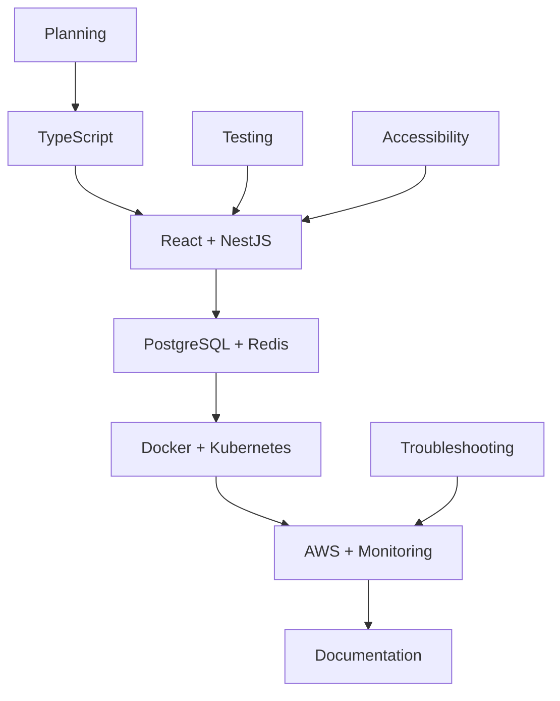
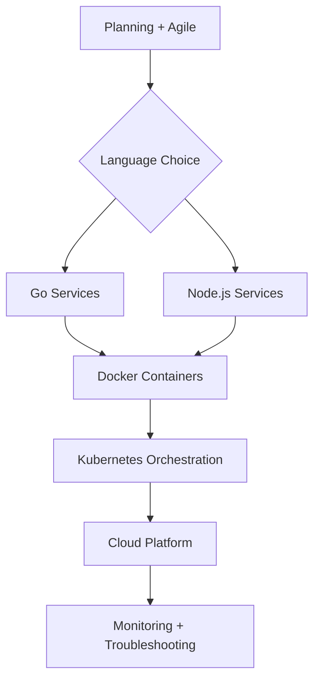
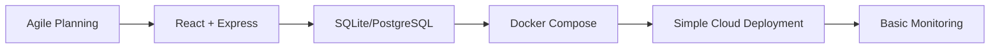

# AI Agentic System - Instruction Files Cross-Reference Index

**Last Updated**: 2025-08-15  
**Total Instruction Files**: 170+  
**Optimized Files**: 29  
**Templates Available**: 11  

## Quick Navigation

### 🚀 **Getting Started - Essential Files**
For new teams or projects, start with these foundational instruction files:

1. **[Planning](general/planning.instructions.md)** - Project planning and estimation methodologies
2. **[Agile](general/agile.instructions.md)** - Agile development practices and workflows  
3. **[Documentation](general/documentation.instructions.md)** - Documentation strategy and implementation
4. **[Troubleshooting](general/troubleshooting.instructions.md)** - Systematic problem resolution
5. **[Git](tools/version-control/git.instructions.md)** - Version control workflows and best practices

### 📋 **Templates for Creating New Instructions**
Use these templates when creating new instruction files:

- **[General Guidelines Template](templates/general-guidelines.instructions.md)** - For methodologies and processes
- **[Language Template](templates/language.instructions.md)** - For programming languages
- **[Framework Template](templates/frameworks.instructions.md)** - For development frameworks
- **[Tools Template](templates/tools.instructions.md)** - For development tools
- **[Cloud Platform Template](templates/cloud-platform.instructions.md)** - For cloud services

## Category-Based Navigation

### 🔧 **Development Methodologies & Processes**

#### Core Methodologies
| File | Focus Area | Related Files |
|------|------------|---------------|
| **[Agile](general/agile.instructions.md)** | Scrum, Kanban, Sprint Planning | Planning, Documentation, Troubleshooting |
| **[Planning](general/planning.instructions.md)** | Project Planning, Estimation | Agile, Risk Management, Resource Allocation |
| **[Documentation](general/documentation.instructions.md)** | Docs-as-Code, API Documentation | Git, Testing, Architecture |
| **[Accessibility](general/accessibility.instructions.md)** | WCAG Compliance, Inclusive Design | UI/UX Frameworks, Testing |
| **[Troubleshooting](general/troubleshooting.instructions.md)** | Incident Response, Root Cause Analysis | Monitoring, Performance Optimization |

#### Quality & Compliance
| File | Focus Area | Integration Points |
|------|------------|-------------------|
| **[Testing/Jest](tools/testing/jest.instructions.md)** | Unit Testing, TDD | JavaScript, TypeScript, CI/CD |
| **[Testing/Playwright](tools/testing/playwright.instructions.md)** | E2E Testing | Web Frameworks, Accessibility |
| **[Git](tools/version-control/git.instructions.md)** | Version Control | All Development Files |

### 🌐 **Languages & Runtime Environments**

#### Primary Languages (Comprehensive)
| Language | File | Complementary Technologies |
|----------|------|---------------------------|
| **JavaScript** | [languages/javascript.instructions.md](languages/javascript.instructions.md) | Node.js, React, Testing |
| **TypeScript** | [languages/typescript.instructions.md](languages/typescript.instructions.md) | JavaScript, React, NestJS |
| **Python** | [languages/python.instructions.md](languages/python.instructions.md) | Django, FastAPI, Data Science |
| **Go** | [languages/go.instructions.md](languages/go.instructions.md) | Microservices, Cloud Native |
| **Rust** | [languages/rust.instructions.md](languages/rust.instructions.md) | Systems Programming, Performance |

#### Emerging Languages (Templates Available)
- **Java** - Enterprise applications, Spring ecosystem
- **C#** - .NET development, Azure integration  
- **PHP** - Web development, Laravel ecosystem
- **Ruby** - Rails development, scripting

### 🏗️ **Frameworks & Libraries**

#### Web Development Frameworks
| Framework | File | Related Technologies |
|-----------|------|---------------------|
| **React** | [frameworks/nodejs-typescript/react.instructions.md](frameworks/nodejs-typescript/react.instructions.md) | TypeScript, Testing, State Management |
| **NestJS** | [frameworks/nodejs-typescript/nest-js.instructions.md](frameworks/nodejs-typescript/nest-js.instructions.md) | TypeScript, Testing, Microservices |
| **Express** | [frameworks/nodejs-typescript/express.instructions.md](frameworks/nodejs-typescript/express.instructions.md) | Node.js, APIs, Middleware |

#### UI/UX Frameworks
| Framework | File | Design Integration |
|-----------|------|-------------------|
| **Tailwind CSS** | [frameworks/ui-ux/tailwind.instructions.md](frameworks/ui-ux/tailwind.instructions.md) | React, Accessibility, Design Systems |
| **Bootstrap** | [frameworks/ui-ux/bootstrap.instructions.md](frameworks/ui-ux/bootstrap.instructions.md) | Responsive Design, Components |

#### Mobile Development
| Platform | File | Cross-Platform Considerations |
|----------|------|------------------------------|
| **Flutter** | [frameworks/mobile/flutter.instructions.md](frameworks/mobile/flutter.instructions.md) | Dart, Cross-platform, UI/UX |
| **React Native** | [frameworks/mobile/react-native.instructions.md](frameworks/mobile/react-native.instructions.md) | React, JavaScript, Native Integration |

### ☁️ **Cloud & Infrastructure**

#### Major Cloud Platforms
| Platform | File | Integration Areas |
|----------|------|------------------|
| **AWS** | [tools/cloud-platforms/aws.instructions.md](tools/cloud-platforms/aws.instructions.md) | Docker, Kubernetes, CI/CD |
| **Google Cloud** | [tools/cloud-platforms/gcp.instructions.md](tools/cloud-platforms/gcp.instructions.md) | Kubernetes, Microservices |
| **Azure** | [tools/cloud-platforms/azure.instructions.md](tools/cloud-platforms/azure.instructions.md) | .NET, DevOps, Enterprise |

#### Containerization & Orchestration
| Technology | File | Related Platforms |
|------------|------|------------------|
| **Docker** | [tools/containerization/docker.instructions.md](tools/containerization/docker.instructions.md) | All Cloud Platforms, Development |
| **Docker Compose** | [tools/containerization/docker-compose.instructions.md](tools/containerization/docker-compose.instructions.md) | Development, Testing, Microservices |
| **Kubernetes** | [tools/infra-as-code/kubernetes.instructions.md](tools/infra-as-code/kubernetes.instructions.md) | Cloud Platforms, Production Deployment |

### 🗄️ **Databases & Data Management**

#### Relational Databases
| Database | File | Use Cases |
|----------|------|-----------|
| **PostgreSQL** | [tools/database/postgresql.instructions.md](tools/database/postgresql.instructions.md) | Web Apps, Analytics, JSON Data |
| **MySQL** | [tools/database/mysql.instructions.md](tools/database/mysql.instructions.md) | Web Apps, E-commerce, Content Management |
| **SQLite** | [tools/database/sqlite.instructions.md](tools/database/sqlite.instructions.md) | Mobile Apps, Prototyping, Embedded |

#### NoSQL Databases
| Database | File | Specialization |
|----------|------|----------------|
| **MongoDB** | [tools/database/mongodb.instructions.md](tools/database/mongodb.instructions.md) | Document Storage, JSON APIs |
| **Redis** | [tools/database/redis.instructions.md](tools/database/redis.instructions.md) | Caching, Session Storage, Real-time |

### 🛠️ **Development Tools**

#### Build Tools & Bundlers
| Tool | File | Framework Integration |
|------|------|----------------------|
| **Webpack** | [tools/build-tools/webpack.instructions.md](tools/build-tools/webpack.instructions.md) | React, Vue, Complex SPAs |
| **Vite** | [tools/build-tools/vite.instructions.md](tools/build-tools/vite.instructions.md) | Modern Frameworks, Fast Development |
| **ESBuild** | [tools/build-tools/esbuild.instructions.md](tools/build-tools/esbuild.instructions.md) | TypeScript, Performance-Critical |

#### Package Managers
| Tool | File | Ecosystem |
|------|------|-----------|
| **npm** | [tools/package-managers/npm.instructions.md](tools/package-managers/npm.instructions.md) | Node.js, JavaScript |
| **yarn** | [tools/package-managers/yarn.instructions.md](tools/package-managers/yarn.instructions.md) | Node.js, Monorepos |
| **pnpm** | [tools/package-managers/pnpm.instructions.md](tools/package-managers/pnpm.instructions.md) | Performance, Disk Space |

## Technology Integration Pathways

### 🎯 **Complete Stack Combinations**

#### **Modern Web Application Stack**
```
Planning → Agile → Git → 
TypeScript → React → NestJS → 
PostgreSQL → Docker Compose → 
AWS → Jest/Playwright → Documentation
```

#### **Microservices Architecture Stack**  
```
Planning → Documentation → Git →
Go/Node.js → Docker → Kubernetes → 
AWS/GCP → PostgreSQL/MongoDB → 
Monitoring → Troubleshooting
```

#### **Rapid Prototyping Stack**
```
Agile → Git → TypeScript → 
React → Express → SQLite → 
Docker Compose → Testing → Documentation
```

### 🔄 **Common Integration Patterns**

#### **Frontend Development Chain**
1. **Start**: [Planning](general/planning.instructions.md) + [Agile](general/agile.instructions.md)
2. **Setup**: [Git](tools/version-control/git.instructions.md) + [TypeScript](languages/typescript.instructions.md)
3. **Framework**: [React](frameworks/nodejs-typescript/react.instructions.md) + [Tailwind](frameworks/ui-ux/tailwind.instructions.md)
4. **Quality**: [Jest](tools/testing/jest.instructions.md) + [Accessibility](general/accessibility.instructions.md)
5. **Deploy**: [Docker](tools/containerization/docker.instructions.md) + [AWS](tools/cloud-platforms/aws.instructions.md)

#### **Backend API Development Chain**
1. **Plan**: [Planning](general/planning.instructions.md) + [Documentation](general/documentation.instructions.md)
2. **Language**: [TypeScript](languages/typescript.instructions.md) or [Go](languages/go.instructions.md)
3. **Framework**: [NestJS](frameworks/nodejs-typescript/nest-js.instructions.md) or [Express](frameworks/nodejs-typescript/express.instructions.md)
4. **Database**: [PostgreSQL](tools/database/postgresql.instructions.md) or [MongoDB](tools/database/mongodb.instructions.md)
5. **Testing**: [Jest](tools/testing/jest.instructions.md) + [Playwright](tools/testing/playwright.instructions.md)
6. **Deploy**: [Docker Compose](tools/containerization/docker-compose.instructions.md) → [AWS](tools/cloud-platforms/aws.instructions.md)

#### **DevOps & Infrastructure Chain**
1. **Foundation**: [Git](tools/version-control/git.instructions.md) + [Documentation](general/documentation.instructions.md)
2. **Containerization**: [Docker](tools/containerization/docker.instructions.md) + [Docker Compose](tools/containerization/docker-compose.instructions.md)
3. **Orchestration**: [Kubernetes](tools/infra-as-code/kubernetes.instructions.md)
4. **Cloud**: [AWS](tools/cloud-platforms/aws.instructions.md) or [GCP](tools/cloud-platforms/gcp.instructions.md)
5. **Monitoring**: [Troubleshooting](general/troubleshooting.instructions.md) + Performance Tools

## Workflow-Based Navigation

### 🏃‍♂️ **Project Lifecycle Workflows**

#### **Project Initialization**
1. [Planning](general/planning.instructions.md) - Define scope and timeline
2. [Agile](general/agile.instructions.md) - Set up development methodology  
3. [Git](tools/version-control/git.instructions.md) - Initialize repository
4. [Documentation](general/documentation.instructions.md) - Create project documentation structure

#### **Development Phase**
1. **Language Selection**: Choose from [Languages](#languages--runtime-environments) based on requirements
2. **Framework Setup**: Select appropriate [Frameworks](#frameworks--libraries)
3. **Database Design**: Choose from [Database](#databases--data-management) options
4. **Testing Strategy**: Implement [Testing Tools](#quality--compliance)

#### **Deployment Phase**  
1. **Containerization**: [Docker](tools/containerization/docker.instructions.md) + [Docker Compose](tools/containerization/docker-compose.instructions.md)
2. **Cloud Platform**: Select from [Cloud Platforms](#major-cloud-platforms)
3. **Monitoring**: [Troubleshooting](general/troubleshooting.instructions.md) setup
4. **Documentation**: Final [Documentation](general/documentation.instructions.md) updates

### 🔍 **Problem-Solving Workflows**

#### **Performance Issues**
1. [Troubleshooting](general/troubleshooting.instructions.md) - Systematic diagnosis
2. Database optimization ([PostgreSQL](tools/database/postgresql.instructions.md), [MongoDB](tools/database/mongodb.instructions.md))
3. Application profiling (Language-specific guides)
4. Infrastructure scaling ([AWS](tools/cloud-platforms/aws.instructions.md), [Kubernetes](tools/infra-as-code/kubernetes.instructions.md))

#### **Quality Issues**
1. [Testing](tools/testing/jest.instructions.md) - Comprehensive test coverage
2. [Accessibility](general/accessibility.instructions.md) - Compliance validation
3. Code quality (Language-specific linting and standards)
4. [Documentation](general/documentation.instructions.md) - Knowledge transfer

#### **Deployment Issues**
1. [Docker](tools/containerization/docker.instructions.md) - Container troubleshooting
2. [Cloud Platform](tools/cloud-platforms/aws.instructions.md) - Infrastructure debugging
3. [Git](tools/version-control/git.instructions.md) - Version control issues
4. [Troubleshooting](general/troubleshooting.instructions.md) - Root cause analysis

## Advanced Integration Scenarios

### 🏢 **Enterprise Patterns**

#### **Large-Scale Web Application**


#### **Microservices Architecture**


### 🚀 **Startup/Rapid Development Patterns**

#### **MVP Development**


## Maintenance and Updates

### 📅 **Regular Review Schedule**
- **Monthly**: Update templates based on new patterns discovered
- **Quarterly**: Review cross-references for new integrations
- **Annually**: Major technology updates and emerging tool additions

### 🔄 **Continuous Improvement Process**
1. **Usage Analytics**: Track which instruction combinations are most common
2. **Feedback Integration**: Incorporate team feedback on instruction effectiveness
3. **Technology Updates**: Keep pace with evolving frameworks and tools
4. **Pattern Recognition**: Identify new successful integration patterns

### 📈 **Growth Roadmap**
- **Phase 5**: Mobile development instruction expansion
- **Phase 6**: AI/ML development instruction integration  
- **Phase 7**: Blockchain and Web3 instruction development
- **Phase 8**: IoT and embedded systems instruction creation

---

## Usage Guidelines

### 🎯 **For AI Assistants**
- Use this index to suggest related instruction files when helping with projects
- Recommend complete technology stacks based on project requirements
- Guide users through logical progression of instruction files
- Identify potential integration points and dependencies

### 👥 **For Development Teams**
- Start with methodology files before diving into technical implementation
- Follow suggested workflow progressions for systematic project development
- Use integration patterns as proven blueprints for technology combinations
- Reference troubleshooting guides when issues arise across multiple technologies

### 📚 **For Knowledge Management**
- This index serves as a living document that evolves with the instruction collection
- Update cross-references when new instruction files are added
- Maintain integration patterns based on successful project outcomes
- Use as a foundation for training and onboarding materials

*This index is automatically updated as new instruction files are created and optimized. For the most current version, check the git history of this file.*